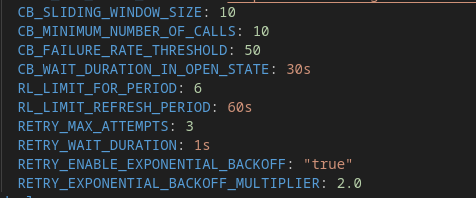
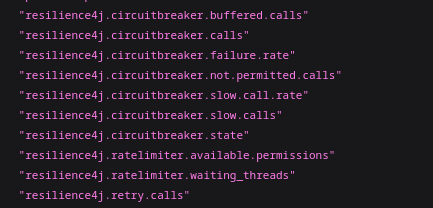
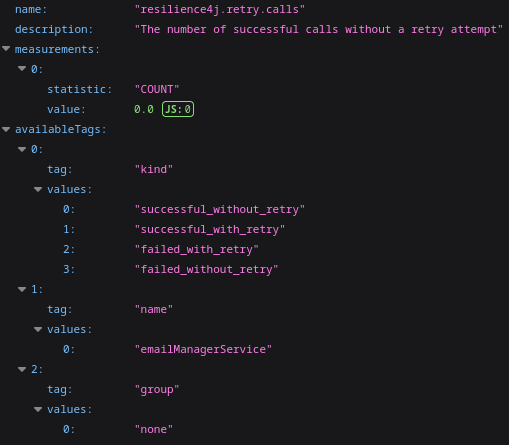
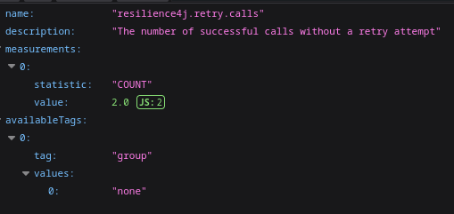

The purpose of project is demonstrate how implements resilience patterns to provider more resilience into microservices.This project consists of multiple services (`email-manager`, and `user-manager`) that can be deployed using Docker and Docker Compose.

## Prerequisites

1. Install [Docker](https://docs.docker.com/get-docker/).
2. Install [Docker Compose](https://docs.docker.com/compose/install/).
3. Ensure the JAR files for each service are built using Maven:
   ```bash
   cd email-manager
   mvn clean package
   ``` 
   
   ```bash
   cd users-manager
   mvn clean package
   ```
## Running the Services with Docker Compose

1. Navigate to the **infrastructure** directory where the `docker-compose.yaml` file is located:
    ```bash
    cd infrastructure
    ```
2. Start the services using Docker Compose:
    ```bash
    docker-compose up --build -d
    ```
3. Checking the logs all services are running:
   ```bash
    docker-compose logs -f
    ```
## Accessing the Services


1. Create new user through swagger:

    - **User Manager:** http://localhost:8090/swagger-ui/index.html

## Testing implementations 

For testing on configurations change this infrastracture/docker-compose.yaml




## Checking metrics using Spring Actuator

For check all metrics Resiliance4j:

    http://localhost:8090/actuator/metrics/




For check only specific metric for example metric this Retry:

    http://localhost:8090/actuator/metrics/resilience4j.retry.calls




For filter specific metric data in retry for example using successful_without_retry make:

    http://localhost:8090/actuator/metrics/resilience4j.retry.calls?tag=name:emailManagerService&tag=kind:successful_without_retry




> 📚 **Read more:** See more information visit this article on Medium: [O que é um software Resiliente? ](https://medium.com/@eduardo.borsato.oli/o-que-%C3%A9-um-software-resiliente-283b35f97bc8)
